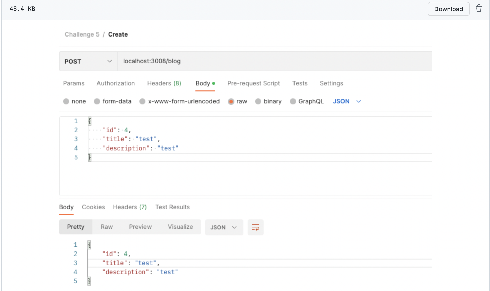
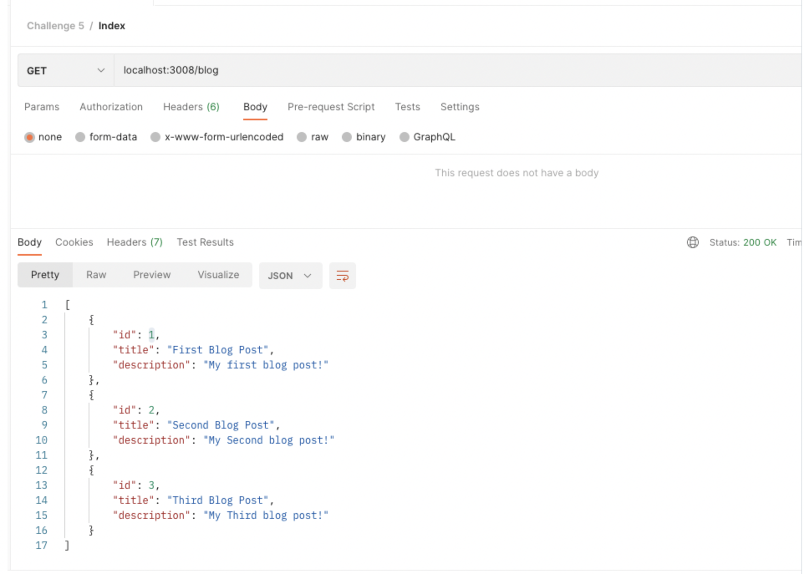
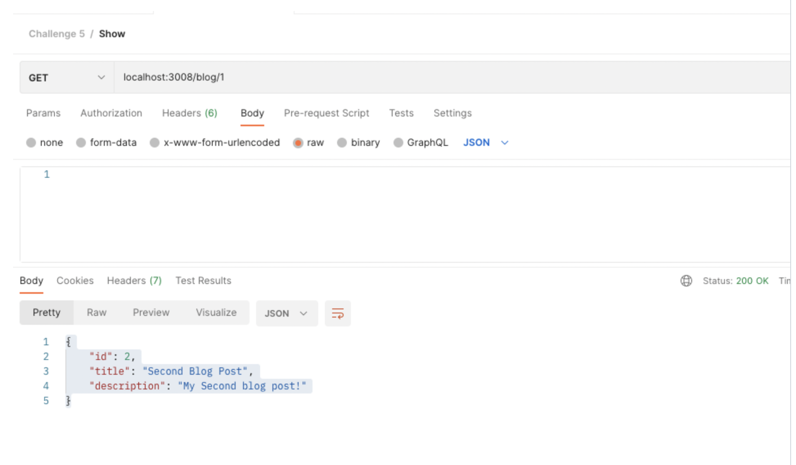

# Paired Homework Week 26 Day2

**[Challenge 1](https://github.com/christine-iyer/pairedHW/blob/main/Challenge1.js)**

**Navigator:** Rosa / Devon

**Driver:** Christine

<details>
     <summary>Create a function addTwo that accepts one input and adds 2 to it.</summary>

```
function addTwo (num) {
    return num + 2
}
console.log(addTwo(4))
```
</details>
<br>

**[Challenge 2](https://github.com/christine-iyer/pairedHW/blob/main/Challenge2.js)**

**Navigator:** Christine/ Devon

**Driver:** Rosa

<details>
<summary>
Create a function addS that accepts one input and adds an "s" to it.</summary>

```
function addS (word){
     return `${word}s`
}
console.log(addS("pizza"))
```
</details>
<br>

**[Challenge 3](https://github.com/christine-iyer/pairedHW/blob/main/Challenge3.js)**

<details>
<summary>Create a function called map that takes two inputs:
an array of numbers (a list of numbers)
a 'callback' function - a function that is applied to each element of the array (inside of the function 'map')
Have map return a new array filled with numbers that are the result of using the 'callback' function on each element of the input array.</summary>

```
function multiplyByTwo (num) {
    return num * 2
}
function map(arr, func) {
    const newArr = []
    arr.forEach(item => {
       newArr.push(func(item))
    })
    return newArr
}

const test = map([1,2,3,4,5], multiplyByTwo)
console.log(test)
```
</details>
<br>

**[Challenge 4](https://github.com/christine-iyer/pairedHW/blob/main/Challenge4.js)**

**Navigator:** Christine/Rosa
**Driver:** Devon

<details>
<summary>
The function forEach takes an array and a callback, and runs the callback on each element of the array. forEach does not return anything.</summary>

```  
function forEach (arr, func){
    for(let i = 0; i < arr.length; i++){
        func(arr[i])
    }
}

let alphabet = '';
const letters = ['a', 'b', 'c', 'd'];
forEach(letters, function(char) {
    alphabet += char;
});
console.log(alphabet); 
```
</details>
<br>

**[Challenge 5](https://github.com/christine-iyer/pairedHW/blob/main/Challenge5/Challenge5.js)**

**Navigator:** Devon/ Rosa
**Driver:** Christine

<details>
<summary>Construct a json api with the ExpressJS Framework. You will not use a database. You will mock a database of blog posts in a seperate JS file with the following starter data.
</summary>

seed.js

```
const mockBlog = [
    {
        id: 1,
        title: 'First Blog Post',
        description: 'My first blog post!'
    },
    {
        id: 2,
        title: 'Second Blog Post',
        description: 'My Second blog post!'
    },
    {
        id: 3,
        title: 'Third Blog Post',
        description: 'My Third blog post!'
    }
];
module.exports = mockBlog
```
Challenge5.js

```
const mockBlog = require('./Challenge5/seed')
const express = require('express')
const Blog =require('./Challenge5/blogSchema')


const app = express()
app.use(express.json())
//index
app.get('/blog', (req,res) => {
     res.send(mockBlog)
})
//show
app.get('/blog/:id', (req, res) => {
     res.send(mockBlog[req.params.id]);
})

 //create
 app.post('/blog', (req,res) => {
     res.send(req.body)
 }

 )
app.listen(3008,() => {
     console.log("I hear you on this port 3008")
})
```
blogSchema.js

```
const {model ,Schema, default: mongoose}= require('mongoose')
const blogSchema = new Schema({
     id: {type: String},
     title: {type: String, required:true},
     description: {type: String, required:true}
})

const Blog = mongoose.model('Blog',blogSchema)
module.exports = Blog


```


</details>

<br>

**[Test Routes in Postman](https://github.com/christine-iyer/pairedHW/tree/main/Challenge5/images)**
<details>
     <summary>Create</summary>



</details>

**[]()**
<details>
     <summary>Index</summary>


</details>


**[]()**
<details>
     <summary>Show</summary>


</details>


